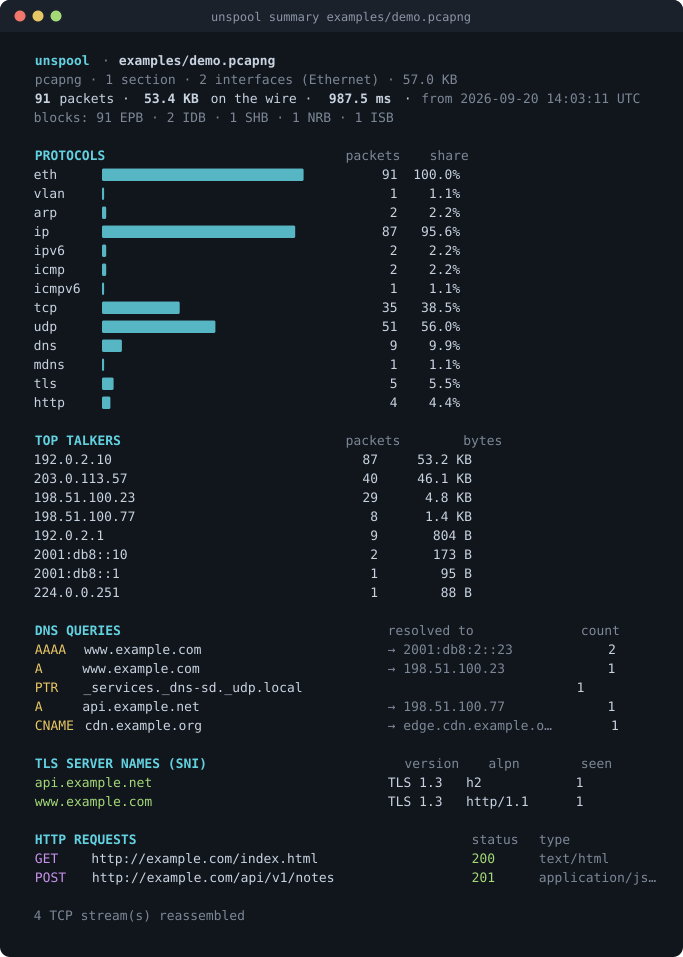

# unspool

A pcapng parser and protocol decoder in pure Python. It reads capture files
and never captures.

[](https://github.com/ElatDev/unspool/actions/workflows/ci.yml)
[](https://www.python.org/downloads/)
[](LICENSE)
[](pyproject.toml)



```console
$ pip install git+https://github.com/ElatDev/unspool
$ unspool summary capture.pcapng
```

I wrote a packet inspector for myself, and the part I found most interesting
was the parser underneath it: pcapng's block structure, and decoders for DNS,
TLS and HTTP written from the specifications. This is that parser, pulled out
into a project of its own.

It doesn't capture packets. Capturing needs a driver and administrator rights,
and that's what ties a tool like this to one operating system. Parsing needs neither, so unspool installs anywhere Python runs, has no
dependencies, never touches your network, and can't produce a file containing
anybody's traffic.

## Features

- **pcapng:** Section Header, Interface Description, Enhanced Packet, Simple
  Packet, the obsolete Packet Block, Name Resolution, Interface Statistics,
  Decryption Secrets and Custom blocks, with their options parsed and named per
  block type; both byte orders; several sections in one file; timestamp
  resolution taken from `if_tsresol` instead of assumed. The specification's
  appendix blocks (systemd journal, IRIG, ARINC-429) are recognized by name and
  skipped.
- **Classic pcap**, including the big-endian, nanosecond and Kuznetsov-patched
  variants, plus transparent gzip, bzip2 and xz.
- **Link, network and transport layers:** Ethernet (with 802.1Q and QinQ
  stacks, 802.3/LLC/SNAP), Linux cooked capture v1 and v2, BSD and OpenBSD
  loopback, raw IP, PPP and PPPoE, ARP/RARP, IPv4 with options and fragments,
  IPv6 with extension headers and fragments, GRE and IP-in-IP tunnels, ICMP and
  ICMPv6 including the original datagram quoted inside an error, TCP with its
  options, and UDP.
- **Application decoders:** DNS (also mDNS and LLMNR, over UDP and TCP, with
  EDNS and the record types worth decoding), TLS handshakes (ClientHello,
  ServerHello, versions, cipher suites, ALPN, SNI, and JA3/JA4 fingerprints),
  and HTTP/1.x (request and status lines, headers, chunked bodies with
  extensions and trailers, gzip/deflate content decoding).
- **TCP stream reassembly**, since a modern ClientHello doesn't fit in one
  segment and HTTP bodies usually don't either. It handles out-of-order
  arrival, overlapping retransmissions, sequence wraparound, captures that
  start mid-connection, and port reuse.
- **A CLI** that summarizes a capture, lists packets, walks the block
  structure, and prints the DNS, TLS and HTTP it found.

## Install

```console
$ pip install git+https://github.com/ElatDev/unspool
```

Python 3.10 or newer, on any operating system. There are no dependencies and
none are planned; everything is standard library. A PyPI release will follow,
and until then the line above installs the same thing.

## Command line

```console
$ unspool summary capture.pcapng      # protocols, talkers, DNS, TLS SNI, HTTP
$ unspool packets capture.pcapng -c 20
$ unspool packets capture.pcapng --last 5      # reads the file backwards
$ unspool blocks capture.pcapng                # the pcapng structure itself
$ unspool dns capture.pcapng
$ unspool tls capture.pcapng                   # SNI, versions, ciphers, JA3/JA4
$ unspool http capture.pcapng --bodies
```

`--json` on `summary`, `packets` and `tls` gives machine-readable output.

`unspool blocks` shows the structure of the file itself:

```console
$ unspool blocks examples/demo.pcapng -c 4
  0x00000000  SHB      168 B  little-endian, version 1.0, section length unspecified
                                shb_os: Linux 6.11 (synthetic)
                                shb_userappl: unspool tools/make_demo.py
                                comment: Synthetic demo capture: documentation addresses only, no real traffic.
  0x000000a8  IDB       64 B  interface 0: Ethernet, snaplen 262144, 1,000,000 ticks/s
                                if_name: wlan0
                                if_description: laptop wireless
                                if_tsresol: 6 (10^-6)
  0x000000e8  IDB       64 B  interface 1: Ethernet, snaplen 262144, 1,000,000 ticks/s
                                if_name: wlan0.video
                                if_description: media stream
                                if_tsresol: 6 (10^-6)
  0x00000128  NRB      100 B  3 record(s): 198.51.100.23=www.example.com, 198.51.100.77=api.example.net, 2001:db8:2::23=www.example.com
```

## Library

```python
import unspool

with unspool.open("capture.pcapng") as cap:
    for pkt in cap:
        if pkt.dns and not pkt.dns.is_response:
            print(pkt.number, pkt.dns.questions[0].name)
```

Layers are plain dataclasses, reachable by type or by name:

```python
from unspool.layers import IPv4, TCP, TLS

for pkt in unspool.packets("capture.pcapng"):
    tcp = pkt.get(TCP)
    if tcp and tcp.syn:
        print(f"{pkt.src}:{tcp.sport} → {pkt.dst}:{tcp.dport}  mss={tcp.option('MSS')}")

    hello = (pkt.get(TLS) or TLS()).client_hello
    if hello:
        print(hello.server_name, hello.ja4(), [hex(c) for c in hello.cipher_suites])
```

The container is available too, options and all:

```python
with unspool.open("capture.pcapng") as cap:
    for block in cap.blocks():
        print(hex(block.offset), block.name, block.options.get("if_name"))
```

`examples/quickstart.py` is a short tour of the whole API.

## Implementation notes

### Reading pcapng backwards

Every pcapng block ends with a second copy of its length, so you can walk the
chain from the end without reading what comes before. `unspool packets --last 20`
does that: it seeks to the end and follows the trailing lengths back, reading
12 bytes per block until it has the packets it needs. On a multi-gigabyte
capture that's much faster than reading from the start. Classic pcap has no
such field, so the same command on a `.pcap` file has to read the whole thing.

### DNS name compression

A name can be replaced by a pointer to an earlier name, and nothing in the
format stops a pointer from pointing at itself, so fourteen hostile bytes can
hang a naive decoder forever. unspool caps the number of pointers per name,
refuses to visit an offset twice, enforces the 255-byte limit on a name's
length, and memoizes decoded names by offset so that a message aiming
thousands of records at one long chain costs linear time instead of quadratic.
Each of those has tests, including one that asserts the decoder gives up in
under a second.

## Testing

Both results below can be reproduced from this repository.

### Comparison with tshark

`tools/compare_tshark.py` downloads the public [Wireshark sample
captures](https://wiki.wireshark.org/SampleCaptures) and compares unspool
against `tshark` frame by frame: the packet count, the set of protocols in
every frame (restricted to those unspool decodes), and the JA3 and JA4
fingerprint of every TLS ClientHello.

Over 562 captures (every pcap or pcapng file on the page) and 1,290,282
packets:

- Packet counts agree in 558 of the 562 files.
- The protocols in each frame agree for 886,786 of 887,640 frames (99.90%).
- JA3 and JA4 fingerprints match on 29 of 36 ClientHellos.
- No input made unspool raise anything but an `UnspoolError`.

All 26 files that differ are explained in the report, and almost all of them
are things unspool doesn't attempt: a tunnel it doesn't unwrap (ISL, 6LoWPAN,
Teredo, JXTA, netlink, L2TP), a capture whose embedded TLS keys tshark uses to
decrypt and unspool doesn't, or a TCP retransmission that tshark doesn't hand
to a subdissector. The seven missed fingerprints are handshakes wrapped inside
JXTA and EAP-TLS.

The full report, with every disagreement and its cause, is in
[compat/README.md](compat/README.md). To reproduce it:

```console
$ python tools/compare_tshark.py --download
```

### Fuzzing

`tools/fuzz.py` mutates valid captures (flipped bits, truncations, corrupt
length fields, spliced noise) and checks that for any input, unspool either
parses it or raises an `UnspoolError`. It should never raise a `struct.error`,
an `IndexError` or a `RecursionError`, and never hang.

A run of 1,000,000 malformed inputs decoded 3.4 million packets with zero
unhandled exceptions, and no input took longer than two seconds:

```console
$ python tools/fuzz.py --cases 1000000 --jobs 8
1,000,000 malformed inputs in 34.8s (28,776/s, 3,405,652 packets decoded)
  parsed without error: 154,686
  refused with an UnspoolError: 845,314
  unhandled exceptions: 0
  inputs slower than 2.0s: 0
```

That run found one real bug: a crafted status line of `"²00"` passed Python's
`str.isdigit()` and then made `int()` raise. It's fixed, and there's a test for
it.

### Fixtures

Every fixture in the test suite is generated by `tests/synth.py`, which builds
captures byte by byte. The addresses in them come from the documentation
ranges (RFC 5737, RFC 3849) and the names from RFC 2606, so the repository
contains no real traffic. See [AUDIT.md](AUDIT.md).

## Performance

It's pure Python. It reads about **30,000 packets a second** fully decoded, or
**90,000 a second** if you only want frames and timestamps (measured on a
Ryzen 7 7800X3D with CPython 3.13, on the largest captures in the Wireshark
sample set). That's fast enough for any capture you'd open in Wireshark by
hand, and too slow for a pipeline working through terabytes; for that you want
something with a C core.

The backward reader is faster than a forward scan because it reads twelve
bytes per block and never touches a packet's payload. On a 13 MB capture of
37,448 frames, `--last 5` takes 0.35 s against 0.64 s to read the same file
forwards, and the gap grows with the size of the packets.

## Limitations

These are out of scope:

- **No packet capture.** No sockets are opened, and the library has no code
  that could open one.
- **No decryption.** A pcapng file may carry TLS keys in a Decryption Secrets
  Block. unspool reports that the block exists and what kind of secret it
  holds, but never reads it. Where `tshark` decrypts such a file and reports
  the HTTP inside, unspool reports TLS and stops, which is one of the
  differences in the compatibility report.
- **No reassembly of IP fragments.** A later fragment is reported as a
  fragment.
- **No GUI and no live monitoring.** It's a library and a terminal tool.

## Development

```console
$ git clone https://github.com/ElatDev/unspool && cd unspool
$ pip install -e ".[dev]"
$ pytest                                  # the test suite
$ ruff check . && mypy                    # lint and types
$ python tools/fuzz.py --cases 100000     # malformed input
$ python tools/compare_tshark.py --download   # needs tshark on PATH
$ python tools/make_demo.py               # rebuild examples/demo.pcapng
$ python tools/render_screenshot.py       # rebuild the picture above
```

## License

MIT. See [LICENSE](LICENSE).
